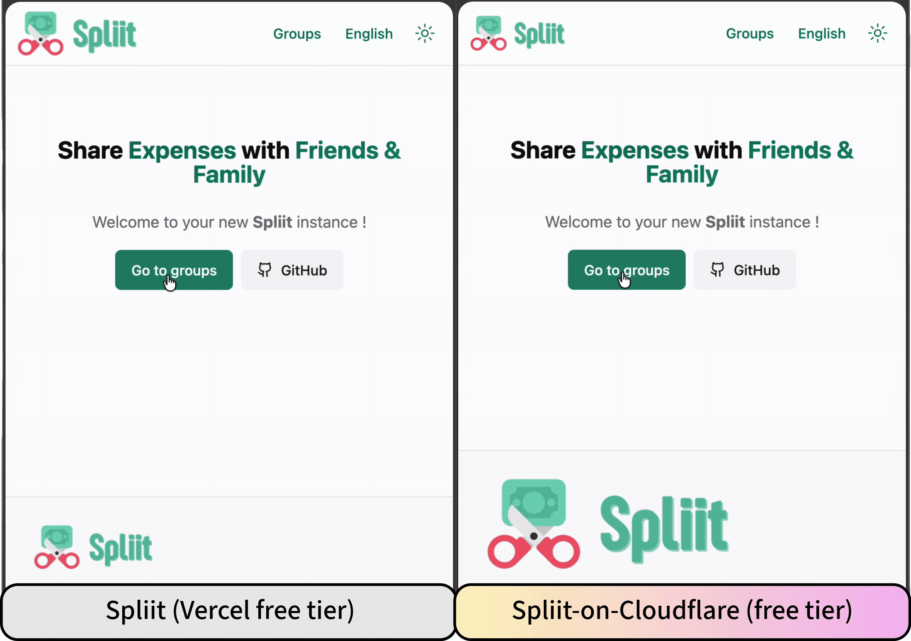

[](https://spliit.app)
(on Cloudflare)

Spliit is a free and open source alternative to Splitwise. This is a fork of the official [Spliit](https://github.com/spliit-app/spliit) project that has been modified to run on the [Cloudflare Workers](https://workers.cloudflare.com/pricing) free tier.

Spliit-on-Cloudflare is intended to not deviate too much from standard Spliit. I welcome contributions and bug reports that concern my modifications. For problems with Spliit, please refer to the official [Spliit](https://github.com/spliit-app/spliit) project.

See the difference between Spliit `1.19.1` hosted on Vercel (free tier) vs. Spliit-on-Cloudflare hosted on Cloudflare (free tier).




## Changes Compared to Spliit

- [x] Based on Spliit `1.19.1`
- [x] Can run on the Cloudflare free tier.
- [x] Import groups from Spliit, functionality courtesy of [@Uli-Z](https://github.com/Uli-Z/spliit-room/tree/feature/generic-import) (adapted for Cloudflare).

## Motivation and Use Cases

Spliit is very easy to deploy on Vercel (free tier) as a NextJS + Postgres application, and it remains the best way to deploy Spliit for most users. The drawback is that the Postgres database on the Vercel free tier is slow.

Users who want a better free, self-hosted user experience can run Spliit-on-Cloudflare.

## Deploy

1. Clone the project (or fork it if you intend to contribute)
2. Initialise `.env` file (based on `.env.example`)
3. Initialise `wrangler.jsonc` file (based on `wrangler.jsonc.example`). Set up a new Cloudflare Worker and D1 database to obtain the necessary keys and information to complete `wrangler.jsonc`).
4. Run `npm install` in the project folder

You can sanity check if everything runs fine locally with the following steps.

1. Run `npm run cloudflare:migrate:local` to initialise a local database.
2. Run `npm run cloudflare:preview` to run a local version of the application. It should say something like `[wrangler:info] Ready on http://localhost:8787`, where you can test the application.

You can deploy the application on Cloudflare with the following steps.

1. Run `npm run cloudflare:migrate:remote` to initialise the remote (production) database.
2. Run `npm run cloudflare:deploy` to push the application to the Cloudflare worker.

## Call For Contributions

I am open to contributions.

- Looking for ideas or contributions to reduce Nextjs' bundle size, which is currently _just shy_ of the maximum of 3MB required for the Cloudflare free tier.

  ```text
  Total Upload: 10214.37 KiB / gzip: 2961.55 KiB
  Worker Startup Time: 30 ms
  Your Worker has access to the following bindings:
  Binding              Resource         
  env.DB (DB)          D1 Database      
  env.ASSETS           Assets   
  ```

## License

The original MIT [LICENSE](./LICENSE) applies.
